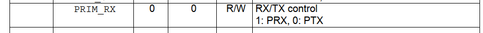
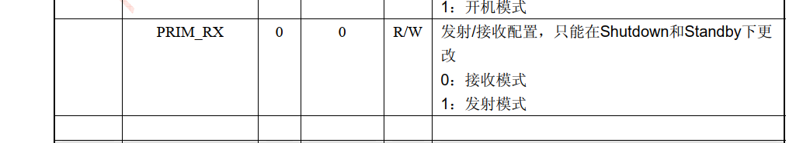

**nRF24L01 的 CONFIG PWR_UP位缺省值是0!! 重新上电需要重新配置,否则无法进入发送模式**

-2021/12/26

**nRF24L01_Send()函数貌似有点问题,不能进入发射模式!调用该函数一段时间后,status发射完成标志位没有置1,重复调用后,status的TX_FIFO满标志位被置位!!!!!**

-2021/12/28

**nRF24L01_Send()函数,调用后EN_AA被更改??**

-2022/1/2

**已经解决nRF24L01_Send()的问题, 是中文资料手册翻译出错!!**

-2022/1/2